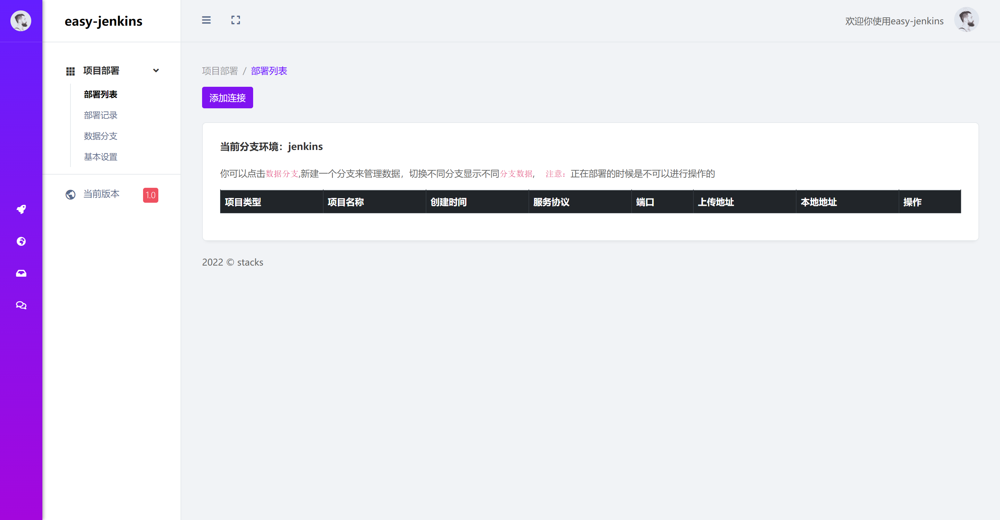
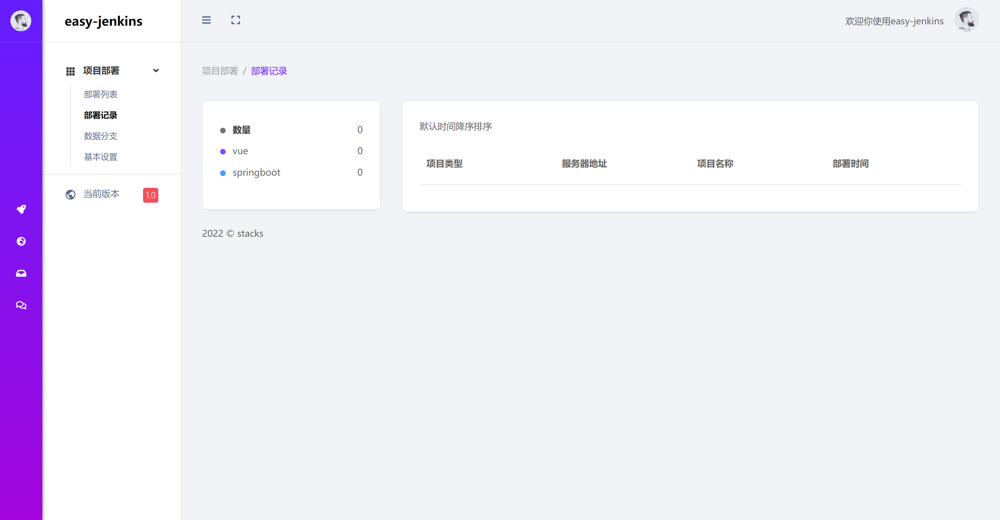
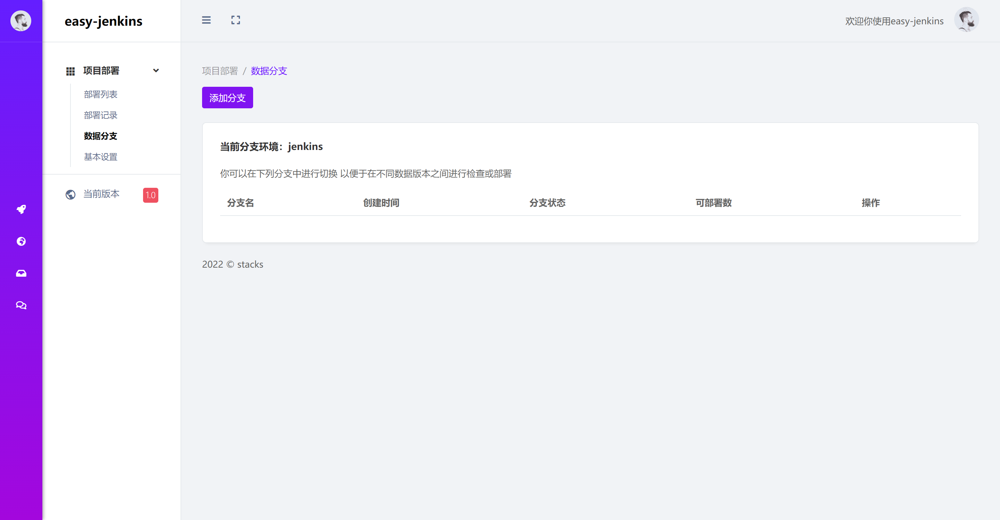
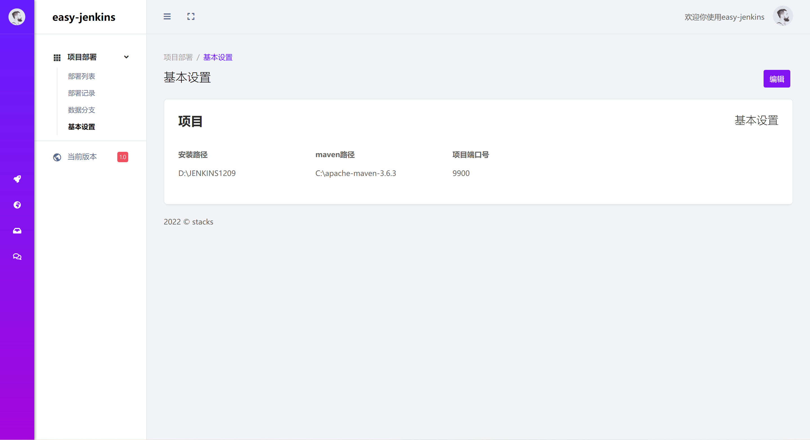

放弃，可以参考前后端不分离的项目，要做一个项目

    

#### 介绍

easy-jenkins是一款对vue和jar的部署工具，操作简单，实行一键部署，内部结构采用流水线形式架构，每次部署，时时提供部署过程，部署记录，界面友好简洁，使用方便，符合用户常规操作，easy-jenkins面向分支形式，无需登录，默认分支为jenkins，每个分支可以配置多个数据源，切换不同分支可以管理不同数据源，easy-jenkins采用本地存储的结构无需配置数据库，简单易上手

### 代码拉取
请拉取最新V1.5版本的代码

### 教程

[easy-jenkins 详细使用教程](https://tanyongpeng.blog.csdn.net/article/details/128223343)

#### 软件架构
springboot 2.7.5 
jsch 0.1.53 
sshj 0.29.0 
thymeleaf 3.0.15 

#### 功能点

- 部署列表
- 部署记录
- 数据分支
- 基本设置

#### 使用说明

主启动类为：EasyJenkinsApplication，启动完成后有一个安装向导，填写相应的配置即可，

#### 效果预览

##### 部署列表

##### 部署记录

##### 数据分支

##### 基本设置

使用感受：使用效果差，docker部署，直接上传jar等工程没有，放弃。
1）java打包，本程序打，无法运行。
2）vue，没有上传。